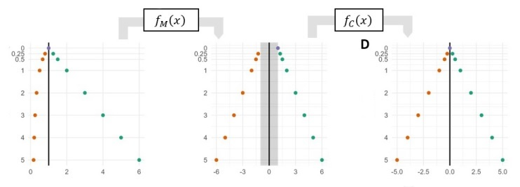

<style type="text/css">
h1.title { font-size: 24px;}
h1 {font-size: 20px;}
</style>


```{r setup, include=FALSE}
knitr::opts_chunk$set(echo = TRUE,warning = FALSE, message = FALSE)

```



# Introduction

This vignette illustrates how to use a MAD-FC transform to visualize fold change measurements in a plot with interval estimates of uncertainty. We will compare visualizing the same data with a linear, log2, and MAD-FC transform. Each of these transforms exhibit different characteristics and emphasizes different aspects of the data, so much so that at first glance it appears that each of these plots are of different datasets.


_Reference for MAD-FC_

B. A. Corliss, Y. Wang, F. P. Driscoll, H. Shakeri, P. E. Bourne, MAD-FC: A Fold Change Visualization with Readability, Proportionality, and Symmetry (2023), [doi:10.48550/arXiv.2303.10829](doi:10.48550/arXiv.2303.10829).

# Dataset and Code Sources

__Dataset Availability:__ This vignette uses a datapoints that were visually extracted from Figure 6a from the following publication:  
O’Shea J., Cremona M., Morgan C., Milewska M., Holmes F., Espina V., Liotta L., O’Shaughnessy J., Toomey S., Madden S. F., Carr A., Elster N., Hennessy B. T., et al A preclinical evaluation of the MEK inhibitor refametinib in HER2-positive breast cancer cell lines including those with acquired resistance to trastuzumab or lapatinib. Oncotarget. 2017; 8: 85120-85135. [doi.org/10.18632/oncotarget.19461](doi.org/10.18632/oncotarget.19461).

Datapoints were visualy extracted from [WebPLotDigitizer](https://automeris.io/WebPlotDigitizer/).

# Package Dependencies
__Primary Packages:__ *tidyverse*

The MAD-FC source file is also required (mirrored_axis_distortion.R)


```{r, results = "hide"}
# Install required Base Packages
base_packages <- c("cowplot", "tidyverse")
install.packages(setdiff(base_packages, rownames(installed.packages())))  

# Load base packages
lapply(base_packages, library, character.only = TRUE)
source(paste0(dirname(getwd()), "/R/mirrored_axis_distortion.R"))
```
  
# Data Analysis Steps

We processing the data with the following steps:

1. Loading the airway dataset.
2. Convert Airway dataset to a DESeq dataset (Enforces non-negative integer values in counts matrix, and an experiment formula).
2. Perform differential expression analysis based on the Negative Binomial distribution.
3. Extract results.
4. Perform shrinkage of effect size, which reduced noise in lowly expressed genes with high variability.
Calculating log2 fold changes, and then refining with shrinkage of effect size.

```{r}
# Load data from csv file
df0 <- read.csv(paste0(getwd(), "/data/protein_expression_John O’Shea.csv"))
df <- pivot_longer(df0,cols = -c("X", "label"), 
                   names_to = "color_pt",values_to = "fc") %>% 
  separate(color_pt, c("color", "pt"), '_') %>%
  pivot_wider(names_from = pt, values_from = fc)

df$log2_hi <- log2(df$hi)
df$log2_mid <- log2(df$mid)
df$log2_lo <- log2(df$lo)

df$mfc_hi <- contract1(fc_to_mfc(df$hi))
df$mfc_mid <- contract1(fc_to_mfc(df$mid))
df$mfc_lo <- contract1(fc_to_mfc(df$lo))

```
  

# Visualization
  
  
We now will visualize the same dataset with an errorbar plot where fold changes are linear, log2, and MAD-FC transformed. Each type of transform has unique characteristics for how it displays the fold change values.

## Linear Errorbar Plot

We first produce an errorbar plot where fold changes are mapped to a linear scale (raw fold change units, y-axis). Notice that with this plot, negative fold changes are compressed between [0,1) and positive fold changes are between (1,inf). This limits the linear plot's usefulness in comparing the datapoints and intervals between positive and negative fold change values.

```{r, out.width="50%", fig.align = 'center'}
# Fold Change Linear Plot
g1 <- ggplot(data = df,aes(x=label, y = mid, color = color)) +
  geom_hline(yintercept = 1, color = "grey") +
  geom_hline(yintercept = c(1.2, 0.8), color = "grey", linetype = "dashed") +
  geom_errorbar(aes(ymax = hi, ymin = lo), linewidth = .8, width = .8, 
                position=position_dodge(width = 0.6), alpha = 1) + 
  geom_point(size = .8,position=position_dodge(width = 0.6),alpha = 1) +
  theme_classic(base_size = 8) + 
  theme(axis.text.x = element_text(angle = 90, vjust = 0.5, hjust=1, size=7),
          legend.position = "none", legend.justification = c("right", "top"),
          legend.box.just = "right", legend.margin = margin(6, 6, 6, 6)
        ) +
  scale_color_manual(name = "Treatment", labels = c("MEKi", "PI3Ki", "MEKI:PI3Ki"), 
                     values = c("#1b9e77", "#d95f02", "#7570b3")) +
  scale_y_continuous(breaks=seq(0,3,.5)) +
  xlab("") + ylab("FC")
g1
```
  
## Log Errorbar plot

Next we produce a Errorbar plot of the same data where fold changes are mapped to a log2 scale (raw fold change units). Log plots exhibit symmetry with positive and negative fold changes, allowing them to be compared based on their relative position to zero on the log scale (the point of no change). However, the non-linearity of the log transform makes it difficult to compare the magnitude of datapoints and intervals among collections of positive fold change data points (and separately, negative fold changes). It is also difficult to recover the original fold change value prior to the log transform.

```{r, out.width="50%", fig.align = 'center'}
# FOld Change Log2 Plot
g2 <- ggplot(data = df,aes(x=label, y = log2_mid, color = color)) +
  geom_hline(yintercept = 0, color = "grey") +
  geom_hline(yintercept = c(-.26, 0.26), color = "grey", linetype = "dashed") +
  geom_errorbar(aes(ymax = log2_hi, ymin = log2_lo), linewidth = .8, width = .8, 
                position=position_dodge(width = 0.6), alpha = 1) + 
  geom_point(size = .8,position=position_dodge(width = 0.6),alpha = 1) +
  theme_classic(base_size = 8) + 
  theme(axis.text.x = element_text(angle = 90, vjust = 0.5, hjust=1, size=7),
        legend.position = "none") +
  scale_color_manual(name = "Treatment", labels = c("MEKi", "PI3Ki", "MEKI:PI3Ki"),
                     values = c("#1b9e77", "#d95f02", "#7570b3")) +
  scale_shape_manual(name = "Treatment", labels = c("MEKi", "PI3Ki", "MEKI:PI3Ki"), 
                     values = c(18, 15, 17)) +
  xlab("") + ylab(expression(log[2]~(FC)))
g2
 
```
  
## MAD Errorbar Plot
Finally we produce a Errorbar plot of the same data where fold changes are mapped to a MAD-FC scale (linear fold change units with negative fold change scale distorted to match the scale of positive fold changes). MAD plots are symmetrical and linear by design, making it easier to compare datapoints and intervals regardless of fold change direction. The linear mapping also makes it easy to recover the original datapoint position from the plot.

To create a MAD plot, first create a linear plot like above, and then call the function.
gg_rev_axis_mfc(gg, axes, num_format)
Where _gg_ is the ggplot object, _axis_ is the axis to be transformed, and _num_format_ is the format used for the plot tick labels.
This function extracts the axis labels from the gg plot object and reverses the MAD-FC transform to display the original FC units.

```{r, out.width="50%", fig.align = 'center'}
# MAD Fold Change Plot
g3 <- ggplot(data = df,aes(x=label, y = mfc_mid, color = color)) +
  geom_hline(yintercept = 0, color = "grey") +
  geom_hline(yintercept = c(.2, -0.2), color = "grey", linetype = "dashed") +
  geom_errorbar(aes(ymax = mfc_hi, ymin = mfc_lo), linewidth = .8, width = .8, 
                position=position_dodge(width = 0.6), alpha = 1) + 
  geom_point(size = .8,position=position_dodge(width = 0.6),alpha = 1) +
  theme_classic(base_size = 8) + 
  theme(axis.text.x = element_text(angle = 90, vjust = 0.5, hjust=1, size=7),
        legend.position = "none", legend.justification = c("right", "top"),
        legend.box.just = "right", legend.margin = margin(6, 6, 6, 6) ) +
  scale_color_manual(name = "Treatment", labels = c("MEKi", "PI3Ki", "MEKI:PI3Ki"), 
                     values = c("#1b9e77", "#d95f02", "#7570b3")) +
  scale_shape_manual(name = "Treatment", labels = c("MEKi", "PI3Ki", "MEKI:PI3Ki"), 
                     values = c(18, 15, 17)) +
  xlab("") + ylab("FC")
g3 <- gg_revaxis_mfc(g3,'y', num_format = "fraction")
g3

```


# Session Information

```{r}
sessionInfo()
```

Bruce Corliss, 10/16/2023