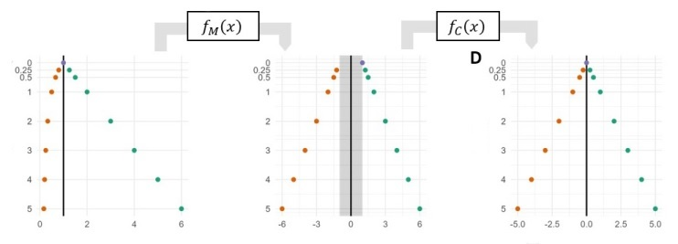

<style type="text/css">
h1.title { font-size: 24px;}
h1 {font-size: 20px;}
</style>


```{r setup, include=FALSE}
knitr::opts_chunk$set(echo = TRUE,warning = FALSE, message = FALSE)

```



# Introduction

This vignette illustrates how to use a MAD-FC transform to visualize fold change measurements in a volcano plot. Volcano plots are scatterplots that visualize statistical significance versus effect size and enable the quick identification of genes that exhibit both high statistical significance and large fold change. MAD-FC is a new transform for fold changes that distorts linear fold change measurements to match the scale of positive fold change measurements. For more information, please refer to the publication.

B. A. Corliss, Y. Wang, F. P. Driscoll, H. Shakeri, P. E. Bourne, MAD-FC: A Fold Change Visualization with Readability, Proportionality, and Symmetry (2023), [doi:10.48550/arXiv.2303.10829](doi:10.48550/arXiv.2303.10829).

# Dataset and Code Sources

__Dataset Availability:__ This vignette uses a dataset that is included with DeseQ2 package.
[Airway](https://bioconductor.org/packages/release/data/experiment/html/airway.html)  [https://pubmed.ncbi.nlm.nih.gov/24926665/](https://pubmed.ncbi.nlm.nih.gov/24926665/).

__Code Reference:__ 
This tutorial uses code from the [introductory vignette](https://bioconductor.org/packages/devel/bioc/vignettes/DESeq2/inst/doc/DESeq2.html#why-un-normalized-counts) for DESeq2.
"Analyzing RNA-seq data with DESeq2" by Michael I. Love, Simon Anders, and Wolfgang Huber.

# Package Dependencies
__Primary Packages:__ *tidyverse, BiocManager, cowplot, magrittr*

__Supporting Packages:__ *DESeq2, airway, EnhancedVolcano*

The MAD-FC source file is also required (mirrored_axis_distortion.R)


```{r, results = "hide"}
# Install required Base Packages
base_packages <- c("magrittr", "tidyverse","BiocManager")
install.packages(setdiff(base_packages, rownames(installed.packages())))  
# Install required Bioconductor Packages
biocm_packages <- c("DESeq2","airway","EnhancedVolcano")
bioc_installs <- setdiff(biocm_packages, rownames(installed.packages()))
if (length(bioc_installs)) {BiocManager::install(bioc_installs) }

# Load base packages
lapply(base_packages, library, character.only = TRUE)
# Load Bioconductor packages packages
lapply(biocm_packages, library, character.only = TRUE)
source(paste0(dirname(getwd()), "/R/mirrored_axis_distortion.R"))
```
  
# Data Analysis Steps

We processing the data with the following steps:

1. Loading the airway dataset.
2. Convert Airway dataset to a DESeq dataset (Enforces non-negative integer values in counts matrix, and an experiment formula).
2. Perform differential expression analysis based on the Negative Binomial distribution.
3. Extract results.
4. Perform shrinkage of effect size, which reduced noise in lowly expressed genes with high variability.
Calculating log2 fold changes, and then refining with shrinkage of effect size.

```{r}
# Load data
data('airway',results='hide')

# Converts airway dataset from RangedSummarizedExperiment to DESeqDataSet class
dds <- DESeqDataSet(airway, design = ~ cell + dex)
# Differential expression analysis based on the Negative Binomial (Gamme-Poisson) distribution
dds <- DESeq(dds)
# Extract results from DESeq analysis
res <- results(dds, contrast = c('dex','trt','untrt'))
#Shrink fold changes associated with a condition
res <- lfcShrink(dds, contrast = c('dex','trt','untrt'), res=res, type = 'normal')

```
  
# Datapoint Transforms and Annotation

Next, the results table is converted to a data frame for plotting with ggplot2. The datapoints are designated as having significantly up-regulated, down-regulated expression, or neither.
```{r}
# COnvert result table to dataframe
df_res <- as.data.frame(res)
# Anottate fold change measurements based on pvaue and statistical significance.
df_res$Change <- "NS"
# if log2Foldchange > 0.6 and pvalue < 0.05, set as "UP" 
df_res$Change[df_res$log2FoldChange > 1 & df_res$padj < 0.1] <- "Up"
# if log2Foldchange < -0.6 and pvalue < 0.05, set as "DOWN"
df_res$Change[df_res$log2FoldChange < -1 & df_res$padj < 0.1] <- "Down"
df_res$Change <- factor(df_res$Change, ordered = TRUE, levels = c("Down", "NS", "Up"))
# Calculate raw fold change from log2 fold change values
df_res$FoldChange <- 2^df_res$log2FoldChange
# Calculate MAD-FC values
df_res$MAD_FoldChange <- contract1(fc_to_mfc(df_res$FoldChange))
```
  
# Visualization {.tabset}


## Volcano Plots
  
  
We now will visualize the same dataset with a volcano plot where fold changes are linear, log2, and MAD-FC transformed. Each type of transform has unique characteristics for how it displays the fold change values.

### Linear Volcano Plot

We first produce a volcano plot where fold changes are mapped to a linear scale (raw fold change units, y-axis). Notice that with this plot, negative fold changes are compressed between [0,1) and positive fold changes are between (1,inf). This limits the linear plot's usefulness in comparing the magnitude of the positive and negative fold change values.

```{r, out.width="50%", fig.align = 'center'}
# Fold Change Linear Plot
g1 <- ggplot(data=df_res, aes(x=FoldChange, y=-log10(pvalue))) +
  geom_vline(xintercept = 1, color = "gray") +
  geom_point(aes(col=Change), size = 0.5, alpha = 0.6, shape = 16) +
  scale_color_manual(values=c("blue", "black", "red"), name = "Change") +
  scale_y_continuous(expand = c(0,0)) +
  theme_classic(base_size = 16)   +
  ylab(expression(-log[10]~(`p-value`))) +  xlab("FC") +
  theme(legend.position = "none")     
g1
```
  
### Log Volcano plot

Next we produce a volcano plot of the same data where fold changes are mapped to a log2 scale (raw fold change units). Log plots exhibit symmetry with positive and negative fold changes, allowing them to be compared based on their relative position to zero on the log scale (the point of no change). However, the non-linearity of the log transform makes it difficult to compare the magnitude among collections of positive fold change data points and separately, negative fold changes. It is also difficult to recover the original fold change value before the log transform.

```{r, out.width="50%", fig.align = 'center'}
# Log2 Plot
g2 <- ggplot(data=df_res, aes(x=log2FoldChange, y=-log10(pvalue))) +
  geom_vline(xintercept = 0, color = "gray") +
  geom_point(aes(col=Change), size = 1, alpha = 0.6, shape = 16) +
  scale_color_manual(values=c("blue", "black", "red"), name = "Change") +
  scale_y_continuous(expand = c(0,0)) +
  theme_classic(base_size = 16) + 
  ylab(expression(-log[10]~(`p-value`))) +  xlab(expression(log[2]~(FC))) +
  theme(legend.position = "none")     
g2
```
  
### MAD Volcano Plot
Finally we produce a volcano plot of the same data where fold changes are mapped to a MAD-FC scale (raw fold change units with negative fold change scale distorted to match the positive fold change scale). MAD plots are symmetrical and linear by design, making it easier to compare datapoints with different fold change direction, datapoints with same direction. The linear mapping makes it easy to recover the original datapoint position from the plot.

To create a MAD plot, first create a linear plot like above, and then call the function.
gg_rev_axis_mfc(gg, axes, num_format)
Where _gg_ is the ggplot object, _axis_ is the axis to be transformed, and _num_format_ is the format used for the plot tick labels.
This function extracts the axis labels from the gg plot object and reverses the MAD-FC transform to display the original FC units.

```{r, out.width="50%", fig.align = 'center'}
# MAD Fold Change Linear Plot
g3 <- ggplot(data=df_res, aes(x=MAD_FoldChange, y=-log10(pvalue))) +
  geom_vline(xintercept = 0, color = "gray") +
  geom_point(aes(col=Change), size = 1, alpha = 0.6, shape = 16) +
  scale_color_manual(values=c("blue", "black", "red"), name = "Change") +
  theme_classic(base_size = 16) +
  ylab(expression(-log[10]~(`p-value`))) +  xlab("FC") +
  theme(legend.position = "none") +
  scale_x_continuous(breaks=c(c(-9, - 4, 0, seq(4,30,5))), expand = c(0,0)) +
  scale_y_continuous(expand = c(0,0))

g3 <- gg_revaxis_mfc(g3,'x', num_format = "fraction")
g3
```


## MA Plots
  
  
We now will visualize the same dataset with a MA plot where fold changes are linear, log2, and MAD-FC transformed. Each type of transform has unique characteristics for how it displays the fold change values.

### Linear MA Plot
  
We first produce a MA plot where fold changes are mapped to a linear scale (raw fold change units, y-axis). Notice that with this plot, negative fold changes are compressed between [0,1) and positive fold changes are between (1,inf). This limits the linear plot's usefulness in comparing the magnitude of the positive and negative fold change values.

```{r, out.width="50%", fig.align = 'center'}
g1 <- ggplot(data = df_res, aes(x = baseMean, y = FoldChange)) +
  geom_hline(yintercept = 1, color = "grey") +
  geom_point(aes(col=Change), size = 0.4, alpha = 0.6, shape = 16) +
  scale_x_log10() +
  scale_color_manual(values=c("blue", "black", "red"), name = "Change") +
  theme_classic(base_size = 16) + 
  ylab("FC") +  xlab("Normalized Mean Count") +
  theme(legend.position = "none")     
g1
```
  
### Log MA plot

Next we produce a MA plot of the same data where fold changes are mapped to a log2 scale (raw fold change units). Log plots exhibit symmetry with positive and negative fold changes, allowing them to be compared based on their relative position to zero on the log scale (the point of no change). However, the non-linearity of the log transform makes it difficult to compare the magnitude among collections of positive fold change data points and separately, negative fold changes. It is also difficult to recover the original fold change value before the log transform.

```{r, out.width="50%", fig.align = 'center'}
# Log2 Plot
g2 <- ggplot(data = df_res, aes(x = baseMean, y = log2FoldChange)) +
  geom_hline(yintercept = 0, color = "grey") +
  geom_point(aes(col=Change), size = 0.4, alpha = 0.6, shape = 16) +
  scale_x_log10() +
  scale_color_manual(values=c("blue", "black", "red"), name = "Change") +
  theme_classic(base_size = 16) + 
  ylab(expression(log[2]~(FC))) +  xlab("Normalized Mean Count") +
  theme(legend.position = "none")     
g2
```
  
### MAD MA Plot
Finally we produce a volcano plot of the same data where fold changes are mapped to a MAD-FC scale (raw fold change units with negative fold change scale distorted to match the positive fold change scale). MAD plots are symmetrical and linear by design, making it easier to compare datapoints with different fold change direction, datapoints with same direction. The linear mapping makes it easy to recover the original datapoint position from the plot.

To create a MAD plot, first create a linear plot like above, and then call the function.
gg_rev_axis_mfc(gg, axes, num_format)
Where _gg_ is the ggplot object, _axis_ is the axis to be transformed, and _num_format_ is the format used for the plot tick labels.
This function extracts the axis labels from the gg plot object and reverses the MAD-FC transform to display the original FC units.

```{r, out.width="50%", fig.align = 'center'}
# Produce a MA plot with MAD-FC transformed fold changes
g3 <- ggplot(data = df_res, aes(x = baseMean, y = MAD_FoldChange)) +
  geom_hline(yintercept = 0, color = "grey") +
  geom_point(aes(col=Change), size = 0.4, alpha = 0.6, shape = 16) +
  scale_x_log10() +
  scale_color_manual(values=c("blue", "black", "red"), name = "Change") +
  scale_y_continuous(breaks = c(-10, 0, 10, 20)) +
  theme_classic(base_size = 16) + 
  ylab("FC") +  xlab("Normalized Mean Count") +
  theme(legend.position = "none")     
g3
g3 <- gg_revaxis_mfc(g3,'y', num_format = "fraction")
g3
```
<br />  

# Session Information

```{r}
sessionInfo()
```

Bruce Corliss, 10/16/2023